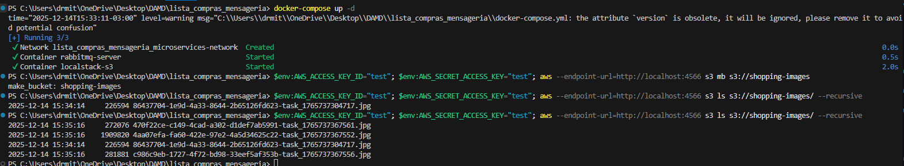
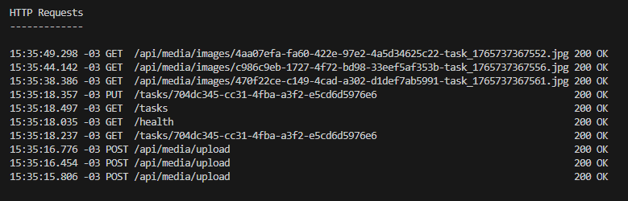
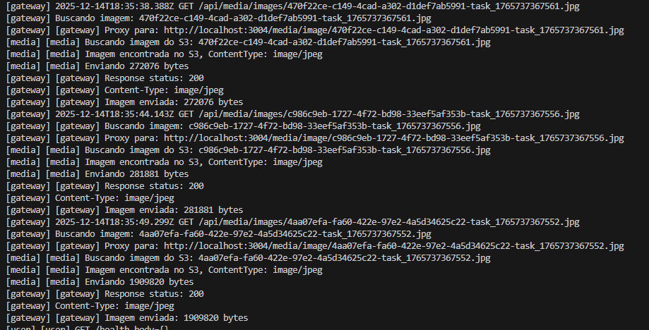
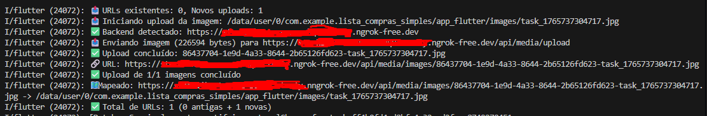

# Sistema de Lista de Compras com LocalStack S3

Sistema distribuído de lista de compras com arquitetura de microserviços, mensageria assíncrona via RabbitMQ e armazenamento de imagens em nuvem simulada usando LocalStack S3.

## Sobre o Projeto

Este projeto implementa uma solução completa de gerenciamento de listas de compras com as seguintes características:

- **Arquitetura de Microserviços**: Cada serviço é independente e se comunica via HTTP e mensageria
- **Simulação de Cloud**: LocalStack simula AWS S3 localmente, permitindo desenvolvimento sem custos de nuvem
- **Mensageria Assíncrona**: RabbitMQ para processamento de eventos em background
- **Mobile First**: Aplicativo Flutter com câmera integrada para fotografar produtos
- **Service Discovery**: Sistema automático de descoberta e registro de serviços
- **Fallback Inteligente**: Imagens carregam da nuvem com fallback local em caso de falha de rede

## Demonstração em Vídeo

add aqui

## Arquitetura

### Visão Geral

O sistema segue uma arquitetura de microserviços onde cada serviço possui responsabilidade única e bem definida. A comunicação entre serviços ocorre de duas formas:

1. **Síncrona**: Requisições HTTP REST via Gateway
2. **Assíncrona**: Eventos publicados no RabbitMQ e processados por consumers

### Fluxo de Dados

```
Mobile App -> Gateway -> Services -> LocalStack S3
                |            |
                |            v
                |       RabbitMQ
                |            |
                |            v
                |      Consumers (Analytics, Notify)
                v
           Service Registry
```

### Backend (Node.js)

- **Gateway** (porta 3000): Roteamento e proxy para S3
- **User Service** (porta 3001): Autenticação e gerenciamento de usuários
- **List Service** (porta 3002): CRUD de listas de compras
- **Item Service** (porta 3003): Catálogo de produtos
- **Media Service** (porta 3004): Upload/download de imagens para S3
- **Analytics Consumer**: Processamento assíncrono de eventos
- **Notify Consumer**: Notificações via mensageria

### Infraestrutura

- **LocalStack S3** (porta 4566): Simulação de AWS S3 local
- **RabbitMQ** (porta 5672/15672): Mensageria entre serviços
- **SQLite**: Banco de dados local

### Frontend

- **Flutter App**: Aplicativo mobile com câmera e upload de fotos

### Detalhes de Implementação

#### Media Service com LocalStack S3

O Media Service é responsável por todo gerenciamento de imagens:

- **Upload**: Recebe imagens em Base64, gera chave única (timestamp) e armazena no S3
- **Download**: Proxy para objetos S3 via gateway público
- **Listagem**: Retorna todas imagens armazenadas no bucket
- **Deleção**: Remove objetos do bucket S3

O bucket `shopping-images` é criado automaticamente na primeira execução do serviço.

#### Gateway com Proxy S3

O Gateway atua como único ponto de entrada para o sistema:

- Roteia requisições para serviços apropriados via service registry
- Implementa proxy transparente para imagens S3
- Permite acesso via ngrok em dispositivos móveis físicos
- Health check endpoint para validação de disponibilidade

#### Service Discovery

Sistema automático que:

- Registra serviços ao iniciar (nome, URL, porta)
- Realiza health checks periódicos (a cada 30 segundos)
- Descobre serviços disponíveis dinamicamente
- Remove serviços não responsivos do registro

#### Mobile App com Flutter

Funcionalidades implementadas:

- **Captura de Fotos**: Integração com câmera do dispositivo
- **Upload Inteligente**: Apenas novas fotos são enviadas (URLs existentes são mantidas)
- **Fallback Local**: Se rede falhar, exibe imagem do cache local
- **Múltiplas Fotos**: Suporte para várias imagens por tarefa
- **Detecção de Backend**: Tenta múltiplas URLs automaticamente (ngrok, localhost, emulador)

## Pré-requisitos

- Node.js 16+
- Docker e Docker Compose
- AWS CLI
- Flutter SDK
- ngrok (opcional, para testes em dispositivo físico)

## Instalação

### 1. Backend

```bash
cd lista_compras_mensageria
npm install
```

### 2. Mobile App

```bash
cd lista_compras_simples
flutter pub get
```

## Execução

### Roteiro de Demonstração

#### 1. Subir Infraestrutura

```bash
cd lista_compras_mensageria
docker-compose up -d
```

Aguarde o LocalStack inicializar completamente (cerca de 10-15 segundos).

#### 2. Configurar AWS CLI e Verificar Bucket

Configure as credenciais de teste:

```bash
$env:AWS_ACCESS_KEY_ID="test"
$env:AWS_SECRET_ACCESS_KEY="test"
```

Liste os buckets disponíveis:

```bash
aws --endpoint-url=http://localhost:4566 s3 ls
```

Saída esperada:

```
2024-01-01 00:00:00 shopping-images
```

#### 3. Iniciar Backend Services

```bash
npm run start:all
```

Serviços disponíveis:

- http://localhost:3000 (Gateway)
- http://localhost:3001 (User Service)
- http://localhost:3002 (List Service)
- http://localhost:3003 (Item Service)
- http://localhost:3004 (Media Service)

#### 4. (Opcional) Expor Gateway via ngrok

Para testes em dispositivo físico:

```bash
ngrok http 3000 --domain=SEU-DOMAIN-AQUI --region=sa
```

#### 5. Executar App Mobile

```bash
cd lista_compras_simples
flutter run
```

Para dispositivo físico com ngrok (sem http nesse):

```bash
flutter run -d <DEVICE_ID> --dart-define=API_BASE_URL="SEU-NGROK-AQUI"
```

#### 6. Validar Upload no S3

Após tirar uma foto no app, liste os objetos no bucket:

```bash
aws --endpoint-url=http://localhost:4566 s3 ls s3://shopping-images/ --recursive
```

Saída esperada:

```
2024-01-01 12:00:00    123456 photo_1234567890.jpg
```

## Endpoints da API

### Media Service

#### Upload de Imagem

```http
POST /api/media/upload
Content-Type: application/json

{
  "image": "base64_encoded_image",
  "filename": "photo.jpg",
  "contentType": "image/jpeg"
}
```

Resposta:

```json
{
  "key": "photo_1234567890.jpg",
  "url": "http://localhost:3000/api/media/images/photo_1234567890.jpg"
}
```

#### Listar Imagens

```http
GET /api/media/list
```

Resposta:

```json
{
  "images": [
    {
      "key": "photo_1234567890.jpg",
      "lastModified": "2024-01-01T12:00:00.000Z",
      "size": 123456,
      "url": "http://localhost:3000/api/media/images/photo_1234567890.jpg"
    }
  ]
}
```

#### Obter Imagem

```http
GET /api/media/images/:key
```

Retorna a imagem em formato binário (JPEG/PNG).

#### Deletar Imagem

```http
DELETE /api/media/images/:key
```

Resposta:

```json
{
  "message": "Image deleted successfully",
  "key": "photo_1234567890.jpg"
}
```

### User Service

#### Registro de Usuário

```http
POST /register
Content-Type: application/json

{
  "username": "usuario",
  "email": "usuario@email.com",
  "password": "senha123"
}
```

#### Login

```http
POST /login
Content-Type: application/json

{
  "username": "usuario",
  "password": "senha123"
}
```

Resposta:

```json
{
  "token": "eyJhbGciOiJIUzI1NiIsInR5cCI6IkpXVCJ9...",
  "user": {
    "id": "123",
    "username": "usuario",
    "email": "usuario@email.com"
  }
}
```

### List Service

#### Criar Lista

```http
POST /lists
Authorization: Bearer <token>
Content-Type: application/json

{
  "name": "Compras do Mês",
  "items": []
}
```

#### Adicionar Item à Lista

- http 3.x
- Dart 3.x
- http package (requisições HTTP)
- camera package (captura de fotos)
- sqflite (banco de dados local)
- path_provider (gerenciamento de arquivos)

## Funcionalidades Implementadas

### Backend

- [x] Autenticação JWT
- [x] CRUD de usuários
- [x] CRUD de listas de compras
- [x] Catálogo de itens
- [x] Upload de imagens para S3
- [x] Download de imagens do S3
- [x] Listagem de imagens no bucket
- [x] Deleção de imagens
- [x] Gateway com roteamento dinâmico
- [x] Service registry com health checks
- [x] Mensageria assíncrona (RabbitMQ)
- [x] Consumers para analytics e notificações
- [x] Persistência em SQLite

### Mobile

- [x] Interface de lista de tarefas
- [x] Captura de fotos pela câmera
- [x] Upload automático para S3
- [x] Exibição de imagens da nuvem
- [x] Fallback para cache local
- [x] Suporte a múltiplas fotos por tarefa
- [x] Detecção automática de backend
- [x] Sincronização de dados
- [x] Modo offline com cache

### Infraestrutura

- [x] LocalStack S3 configurado
- [x] RabbitMQ com management UI
- [x] Docker Compose para orquestração
- [x] Bucket S3 criado automaticamente
- [x] Network isolada para serviços
- [x] Persistência de dados no volume

## Conceitos e Padrões Aplicados

### Arquitetura

- **Microserviços**: Serviços independentes com responsabilidade única
- **Gateway Pattern**: Único ponto de entrada para o sistema
- **Service Discovery**: Registro e descoberta automática de serviços
- **Event-Driven**: Comunicação assíncrona via eventos
- **CQRS Simplificado**: Separação entre comandos e consultas

### Desenvolvimento

- **RESTful API**: Endpoints seguindo convenções REST
- **JWT Authentication**: Autenticação stateless com tokens
- **Base64 Encoding**: Transmissão de imagens via JSON
- **Proxy Pattern**: Gateway como proxy para S3
- **Fallback Strategy**: Resiliência em caso de falha de rede

### Infraestrutura

- **Infrastructure as Code**: Docker Compose para ambiente completo
- **Cloud Simulation**: LocalStack para desenvolvimento local
- **Message Queue**: RabbitMQ para processamento assíncrono
- **Health Checks**: Monitoramento contínuo de serviços

## Decisões Técnicas

### Por que LocalStack?

- Desenvolvimento local sem custos de nuvem
- Mesma API do AWS S3 real
- Fácil migração para S3 real em produção
- Isolamento do ambiente de desenvolvimento

### Por que RabbitMQ?

- Processamento assíncrono de eventos
- Desacoplamento entre serviços
- Garantia de entrega de mensagens
- Escalabilidade horizontal

### Por que SQLite?

- Simplicidade para desenvolvimento
- Sem necessidade de servidor dedicado
- Suficiente para demonstração acadêmica
- Fácil portabilidade

### Por que Service Registry Customizado?

- Demonstração de conceitos de service discovery
- Evita dependência de ferramentas complexas (Consul, Eureka)
- Implementação educacional do padrão
- Controle total sobre o comportamentoplication/json

```
{
"itemId": "item_123",
"quantity": 2,
"notes": "Preferir orgânicos"
}
```

#### Checkout (Finalizar Lista)

```http
POST /lists/:id/checkout
Authorization: Bearer <token>
```

Este endpoint publica um evento no RabbitMQ que é processado pelos consumers de analytics e notificações.

### Item Service

#### Buscar Itens

```http
GET /items/search?q=arroz
```

Resposta:

```json
{
  "results": [
    {
      "id": "item_123",
      "name": "Arroz Integral 1kg",
      "category": "Grãos",
      "estimatedPrice": 8.99
    }
  ]
}
```

## Comandos AWS CLI Úteis

### Listar Buckets

```bash
aws --endpoint-url=http://localhost:4566 s3 ls
```

### Listar Objetos no Bucket

```bash
aws --endpoint-url=http://localhost:4566 s3 ls s3://shopping-images/ --recursive
```

### Deletar Todas as Imagens

```bash
aws --endpoint-url=http://localhost:4566 s3 rm s3://shopping-images/ --recursive
```

### Download de Imagem

```bash
aws --endpoint-url=http://localhost:4566 s3 cp s3://shopping-images/photo_123.jpg ./photo_123.jpg
```

## Estrutura do Projeto

- Teste a URL diretamente no navegador do celular

### AWS CLI retorna erro

- Configure as variáveis de ambiente corretamente
- Use sempre `--endpoint-url=http://localhost:4566`
- Verifique se o LocalStack está rodando: `docker ps`

### Serviços não se comunicam

- Verifique se todos os serviços estão registrados: `GET http://localhost:3000/health`
- Confirme que o service registry está funcionando
- Restart dos serviços: `npm run start:all`

### RabbitMQ não processa eventos

- Acesse management UI: http://localhost:15672 (guest/guest)
- Verifique se há mensagens na fila
- Confirme que os consumers estão rodando nos logs

## Melhorias Futuras

- Implementar cache Redis para sessões
- Adicionar testes automatizados (Jest, Flutter test)
- Implementar CI/CD com GitHub Actions
- Migrar para AWS S3 real em produção
- Adicionar monitoramento com Prometheus/Grafana
- Implementar rate limiting no Gateway
- Adicionar compressão de imagens antes do upload
- Suporte a múltiplos formatos de imagem (WebP)
- Implementar paginação nas listagens
- Adicionar filtros e busca avançada

## Referências

- [LocalStack Documentation](https://docs.localstack.cloud/)
- [AWS SDK for JavaScript v3](https://docs.aws.amazon.com/AWSJavaScriptSDK/v3/latest/)
- [RabbitMQ Tutorials](https://www.rabbitmq.com/getstarted.html)
- [Flutter Documentation](https://docs.flutter.dev/)
- [Microservices Pattern](https://microservices.io/patterns/microservices.html)

## Estrutura do Projeto

```
lista_compras_mensageria/
├── docker-compose.yml          # LocalStack + RabbitMQ
├── package.json                # Dependências do backend
├── start-all.js               # Script para iniciar todos os serviços
├── gateway/
│   └── index.js               # Gateway com proxy S3
├── services/
│   ├── media/
│   │   └── index.js          # Serviço de upload S3
│   ├── user/
│   ├── item/
│   ├── list/
│   └── consumers/
│       ├── analytics.js      # Consumidor de eventos
│       └── notify.js         # Consumidor de notificações
├── shared/
│ ├── jsonDb.js # Wrapper SQLite
│ └── serviceRegistry.js # Service discovery
└── data/
├── app.db # Banco SQLite
└── \*.json # Dados iniciais

lista_compras_simples/
├── pubspec.yaml # Dependências Flutter
└── lib/
├── main.dart
├── models/
├── screens/
│ └── task_form_screen.dart # Tela com câmera
├── services/
│ ├── camera_service.dart # Captura de fotos
│ └── media_service.dart # Upload para S3
└── widgets/

```

## Tecnologias Utilizadas

### Backend

- Node.js
- Express.js
- better-sqlite3
- AWS SDK v3 (@aws-sdk/client-s3)
- amqplib (RabbitMQ)
- jsonwebtoken

### Infraestrutura

- LocalStack
- RabbitMQ
- Docker

### Mobile

- Flutter
- Dart
- http package
- camera package

## Evidências de Funcionamento

### Screenshots









### Logs de Upload

```

Iniciando upload da imagem: /path/to/photo.jpg
Enviando imagem (123456 bytes) para http://localhost:3000/api/media/upload
Upload concluído: photo_1234567890.jpg
URL: http://localhost:3000/api/media/images/photo_1234567890.jpg

```

### Validação AWS CLI

```

$ aws --endpoint-url=http://localhost:4566 s3 ls s3://shopping-images/ --recursive
2024-01-01 12:00:00 123456 photo_1234567890.jpg
2024-01-01 12:05:00 234567 photo_0987654321.jpg

```

## Troubleshooting

### LocalStack não sobe

- Certifique-se de que o Docker está rodando
- Verifique se a porta 4566 não está em uso
- Execute `docker-compose logs localstack` para ver erros

### Imagens não aparecem no app mobile

- Verifique se o ngrok está rodando (dispositivo físico)
- Confirme a conectividade: teste o endpoint `/health`
- Verifique os logs do Media Service

### AWS CLI retorna erro

- Configure as variáveis de ambiente corretamente
- Use sempre `--endpoint-url=http://localhost:4566`

## Contato e Suporte

Para dúvidas sobre o projeto, consulte a documentação ou entre em contato com a equipe de desenvolvimento.

## Licença

Este projeto foi desenvolvido para fins acadêmicos.

Evidências:

https://github.com/user-attachments/assets/0e337661-1fd8-40f4-85ac-008040cfdada
